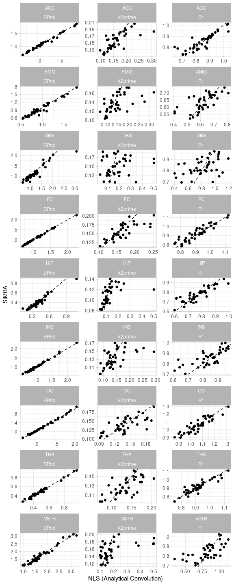

SiMBA SRTM Demonstration
================

- [Aims](#aims)
- [Preparation](#preparation)
  - [Libraries](#libraries)
  - [Data](#data)
- [Data Exploration](#data-exploration)
  - [Main Dataset](#main-dataset)
- [Modelling](#modelling)
  - [Conventional Fitting](#conventional-fitting)
    - [Parameter Estimates](#parameter-estimates)
    - [Inference](#inference)
  - [RefTAC Modelling](#reftac-modelling)
  - [Reference Error Discussion](#reference-error-discussion)
  - [Nonlinear Least Squares (NLS) with a fitted reference
    region](#nonlinear-least-squares-nls-with-a-fitted-reference-region)
    - [Parameter Estimates](#parameter-estimates-1)
    - [Inference](#inference-1)
  - [SiMBA](#simba)
  - [Testing the Function with a single
    TAC](#testing-the-function-with-a-single-tac)
  - [Fitting the SiMBA model](#fitting-the-simba-model)
- [Evaluating the Model](#evaluating-the-model)
  - [Inferences](#inferences)
  - [Parameter Estimates](#parameter-estimates-2)

# Aims

Here I aim to demonstrate the application of SiMBA and reference tissue
models on a simulated dataset

# Preparation

## Libraries

First we load the required packages.

``` r
library(tidyverse)
library(lme4)
library(lmerTest)
library(brms)
library(rstan)
library(cmdstanr)
library(furrr)
library(tictoc)
library(broom.mixed)

#remotes::install_github("mathesong/kinfitr")
library(kinfitr)

theme_set(theme_light())

set.seed(42)
```

## Data

The first step is to prepare your data so that it is ready for
modelling. For SiMBA, the data needs to be in a long format, where there
is a column for region and for time, and then a column for the time
activity curve, or TAC, value in that region at that time point. For
*kinfitr* and SiMBA with reference tissue models, I would usually take
this one step further and pull out the TAC for the reference region, and
place it beside the TACs for all of the target regions.

The data ends up looking like this:

``` r
rawdata <- readRDS("../RawData/rawdata.rds") 

rawdata
```

    ## # A tibble: 13,680 × 10
    ##    ID        PET               Group   Treatment Region  t_tac   dur    TAC kfweights  RefCBL
    ##    <chr>     <chr>             <chr>   <chr>     <chr>   <dbl> <dbl>  <dbl>     <dbl>   <dbl>
    ##  1 Control_1 Control_1_Control Control Control   FC     0.0833 0.167  0.569     0.500 -0.252 
    ##  2 Control_1 Control_1_Control Control Control   FC     0.25   0.167  0.324     0.507 -0.0443
    ##  3 Control_1 Control_1_Control Control Control   FC     0.417  0.167  8.52      0.599  9.81  
    ##  4 Control_1 Control_1_Control Control Control   FC     0.583  0.167  9.64      0.604  9.56  
    ##  5 Control_1 Control_1_Control Control Control   FC     0.75   0.167 10.9       0.603 10.7   
    ##  6 Control_1 Control_1_Control Control Control   FC     0.917  0.167 10.4       0.606 10.5   
    ##  7 Control_1 Control_1_Control Control Control   FC     1.08   0.167 10.4       0.608 10.2   
    ##  8 Control_1 Control_1_Control Control Control   FC     1.25   0.167 11.0       0.605 10.1   
    ##  9 Control_1 Control_1_Control Control Control   FC     1.42   0.167 10.6       0.609 10.4   
    ## 10 Control_1 Control_1_Control Control Control   FC     1.62   0.25  10.2       0.630  9.75  
    ## # ℹ 13,670 more rows

where *t_tac* represents the time, *dur* represents the duration of the
frame, TAC represents the radioactivity in the target region, RefCBL
represents the radioactivity in the reference region (in this case the
cerebellum, CBL), and kfweights represents the *kinfitr* weights which
were calculated in advance (and which are not necessary for fitting the
data using SiMBA).

I’ve also included some true values for getting some insight into the
simulations

``` r
truedata <- readRDS("../RawData/truedata.rds")

truedata
```

    ## # A tibble: 13,680 × 21
    ##    ID        PET      Group Treatment Region  t_tac logR1_true logBPnd_true logk2prime_true sigma_true t0_true A_true B_true C_true alpha_true beta_true gamma_true Ph1_true
    ##    <chr>     <chr>    <chr> <chr>     <chr>   <dbl>      <dbl>        <dbl>           <dbl>      <dbl>   <dbl>  <dbl>  <dbl>  <dbl>      <dbl>     <dbl>      <dbl>    <dbl>
    ##  1 Control_1 Control… Cont… Control   FC     0.0833    -0.0678        0.480           -2.09      -1.59   0.232  6302.   432.  -432.       18.7     0.162      0.161    0.573
    ##  2 Control_1 Control… Cont… Control   FC     0.25      -0.0678        0.480           -2.09      -1.59   0.232  6302.   432.  -432.       18.7     0.162      0.161    0.573
    ##  3 Control_1 Control… Cont… Control   FC     0.417     -0.0678        0.480           -2.09      -1.59   0.232  6302.   432.  -432.       18.7     0.162      0.161    0.573
    ##  4 Control_1 Control… Cont… Control   FC     0.583     -0.0678        0.480           -2.09      -1.59   0.232  6302.   432.  -432.       18.7     0.162      0.161    0.573
    ##  5 Control_1 Control… Cont… Control   FC     0.75      -0.0678        0.480           -2.09      -1.59   0.232  6302.   432.  -432.       18.7     0.162      0.161    0.573
    ##  6 Control_1 Control… Cont… Control   FC     0.917     -0.0678        0.480           -2.09      -1.59   0.232  6302.   432.  -432.       18.7     0.162      0.161    0.573
    ##  7 Control_1 Control… Cont… Control   FC     1.08      -0.0678        0.480           -2.09      -1.59   0.232  6302.   432.  -432.       18.7     0.162      0.161    0.573
    ##  8 Control_1 Control… Cont… Control   FC     1.25      -0.0678        0.480           -2.09      -1.59   0.232  6302.   432.  -432.       18.7     0.162      0.161    0.573
    ##  9 Control_1 Control… Cont… Control   FC     1.42      -0.0678        0.480           -2.09      -1.59   0.232  6302.   432.  -432.       18.7     0.162      0.161    0.573
    ## 10 Control_1 Control… Cont… Control   FC     1.62      -0.0678        0.480           -2.09      -1.59   0.232  6302.   432.  -432.       18.7     0.162      0.161    0.573
    ## # ℹ 13,670 more rows
    ## # ℹ 3 more variables: Th1_true <dbl>, sigma_w_true <dbl>, TAC_true <dbl>

Now, if we want to know what the true RefCBL TAC was at each time point,
we can simply generate it by predicting from the model

``` r
truedata <- truedata %>% 
  mutate(RefCBL_true = feng_1tc_tac_model(t_tac, t0_true, 
                                          A_true, B_true, C_true, 
                                          alpha_true, beta_true, gamma_true, 
                                          Ph1_true, Th1_true))
```

# Data Exploration

## Main Dataset

This data consists of simulated data from 10 controls, before and after
treatment with a placebo intervention (true effect = 0); as well as 10
patients before and after treatment with a real intervention (true
effect = +0.04 in logBPnd). The patient group has a mean logBPnd of 0.08
less than the control group.

Each individual is defined by ID,, group membership is defined by Group,
intervention is defined by Treatment, and each individual PET
measurement is defined by PET.

``` r
unique(rawdata$ID)
```

    ##  [1] "Control_1"  "Control_2"  "Control_3"  "Control_4"  "Control_5"  "Control_6"  "Control_7"  "Control_8"  "Control_9"  "Control_10" "Patient_1"  "Patient_2" 
    ## [13] "Patient_3"  "Patient_4"  "Patient_5"  "Patient_6"  "Patient_7"  "Patient_8"  "Patient_9"  "Patient_10"

``` r
unique(rawdata$Group)
```

    ## [1] "Control" "Patient"

``` r
unique(rawdata$Treatment)
```

    ## [1] "Control"   "Placebo"   "Treatment"

``` r
unique(rawdata$PET)
```

    ##  [1] "Control_1_Control"    "Control_1_Placebo"    "Control_2_Control"    "Control_2_Placebo"    "Control_3_Control"    "Control_3_Placebo"    "Control_4_Control"   
    ##  [8] "Control_4_Placebo"    "Control_5_Control"    "Control_5_Placebo"    "Control_6_Control"    "Control_6_Placebo"    "Control_7_Control"    "Control_7_Placebo"   
    ## [15] "Control_8_Control"    "Control_8_Placebo"    "Control_9_Control"    "Control_9_Placebo"    "Control_10_Control"   "Control_10_Placebo"   "Patient_1_Control"   
    ## [22] "Patient_1_Treatment"  "Patient_2_Control"    "Patient_2_Treatment"  "Patient_3_Control"    "Patient_3_Treatment"  "Patient_4_Control"    "Patient_4_Treatment" 
    ## [29] "Patient_5_Control"    "Patient_5_Treatment"  "Patient_6_Control"    "Patient_6_Treatment"  "Patient_7_Control"    "Patient_7_Treatment"  "Patient_8_Control"   
    ## [36] "Patient_8_Treatment"  "Patient_9_Control"    "Patient_9_Treatment"  "Patient_10_Control"   "Patient_10_Treatment"

Looking at the a randomly selected PET measurement, let’s visualise the
measured TACs.

``` r
dat_1 <- rawdata %>% 
  filter(PET == PET[sample(1:nrow(rawdata),1)])

ggplot(dat_1, aes(x=t_tac, y=TAC, colour=Region)) +
  geom_point() +
  geom_line(linewidth=0.1) +
  coord_cartesian(ylim=c(0,10))
```

<!-- -->

Let’s now compare these with their true values, as if these TACs were
measured without any error, shown here with the lines.

``` r
true_1 <- truedata %>% 
  filter(PET == dat_1$PET[1])
  

ggplot(dat_1, aes(x=t_tac, y=TAC, colour=Region)) +
  geom_point(aes(y=TAC)) +
  geom_line(data=true_1, linewidth=0.3, aes(y=TAC_true)) +
  coord_cartesian(ylim=c(0,10))
```

<!-- -->

Lastly, we need to consider the reference region TAC from which these
were generated, shown in black.

``` r
ggplot(dat_1, aes(x=t_tac, y=TAC, colour=Region)) +
  geom_point(aes(y=TAC)) +
  geom_point(aes(y = RefCBL), colour="black") +
  geom_line(data=true_1, linewidth=0.3, aes(y=TAC_true)) +
  geom_line(data=true_1, aes(y = RefCBL_true), colour="black") +
  coord_cartesian(ylim=c(0,10))
```

<!-- -->

# Modelling

## Conventional Fitting

First, I will demonstrate a conventional kinetic modelling procedure on
the data using my package *kinfitr*. First, we need to nest the data for
each ROI.

``` r
rawdata_nested <- rawdata %>% 
  group_by(ID, PET, Group, Treatment, Region) %>% 
  nest(.key="tacs")
```

The data then looks like this

``` r
rawdata_nested
```

    ## # A tibble: 360 × 6
    ## # Groups:   ID, PET, Group, Treatment, Region [360]
    ##    ID        PET               Group   Treatment Region tacs             
    ##    <chr>     <chr>             <chr>   <chr>     <chr>  <list>           
    ##  1 Control_1 Control_1_Control Control Control   FC     <tibble [38 × 5]>
    ##  2 Control_1 Control_1_Control Control Control   ACC    <tibble [38 × 5]>
    ##  3 Control_1 Control_1_Control Control Control   AMG    <tibble [38 × 5]>
    ##  4 Control_1 Control_1_Control Control Control   DBS    <tibble [38 × 5]>
    ##  5 Control_1 Control_1_Control Control Control   HIP    <tibble [38 × 5]>
    ##  6 Control_1 Control_1_Control Control Control   INS    <tibble [38 × 5]>
    ##  7 Control_1 Control_1_Control Control Control   OC     <tibble [38 × 5]>
    ##  8 Control_1 Control_1_Control Control Control   THA    <tibble [38 × 5]>
    ##  9 Control_1 Control_1_Control Control Control   VSTR   <tibble [38 × 5]>
    ## 10 Control_1 Control_1_Placebo Control Placebo   FC     <tibble [38 × 5]>
    ## # ℹ 350 more rows

… and then the nested table called “tacs” for each measurement and
region looks like this:

``` r
rawdata_nested$tacs[[1]]
```

    ## # A tibble: 38 × 5
    ##     t_tac   dur    TAC kfweights  RefCBL
    ##     <dbl> <dbl>  <dbl>     <dbl>   <dbl>
    ##  1 0.0833 0.167  0.569     0.500 -0.252 
    ##  2 0.25   0.167  0.324     0.507 -0.0443
    ##  3 0.417  0.167  8.52      0.599  9.81  
    ##  4 0.583  0.167  9.64      0.604  9.56  
    ##  5 0.75   0.167 10.9       0.603 10.7   
    ##  6 0.917  0.167 10.4       0.606 10.5   
    ##  7 1.08   0.167 10.4       0.608 10.2   
    ##  8 1.25   0.167 11.0       0.605 10.1   
    ##  9 1.42   0.167 10.6       0.609 10.4   
    ## 10 1.62   0.25  10.2       0.630  9.75  
    ## # ℹ 28 more rows

So, now we fit the SRTM model to each TAC, which are all nested within
the nested tacs tables.

``` r
rawdata_fits <- rawdata_nested %>% 
  group_by(ID, PET, Region) %>% 
  mutate(srtmfit = map(tacs, ~srtm(t_tac=.x$t_tac, reftac=.x$RefCBL, 
                                   roitac=.x$TAC, weights=.x$kfweights, 
                                   multstart_iter = 10)))

saveRDS(rawdata_fits, "../DerivedData/rawdata_srtmfits.rds")
```

In order to avoid having to re-fit the TACs, I’ve saved everything to
the DerivedData folder, and we can load it from there.

``` r
rawdata_fits <- readRDS("../DerivedData/rawdata_srtmfits.rds")
```

Let’s see the fits from the first individual

``` r
rawdata_fits %>% 
  ungroup() %>% 
  filter(PET == PET[1]) %>% 
  mutate(plot = map2(srtmfit, Region, ~plot(.x) + labs(title=.y))) %>% 
  pull(plot)
```

    ## [[1]]

<!-- -->

    ## 
    ## [[2]]

<!-- -->

    ## 
    ## [[3]]

<!-- -->

    ## 
    ## [[4]]

<!-- -->

    ## 
    ## [[5]]

<!-- -->

    ## 
    ## [[6]]

<!-- -->

    ## 
    ## [[7]]

<!-- -->

    ## 
    ## [[8]]

<!-- -->

    ## 
    ## [[9]]

<!-- -->

### Parameter Estimates

And let’s plot the output parameters

``` r
rawdata_pars <- rawdata_fits %>% 
  mutate(pars = map(srtmfit, "par")) %>% 
  select(ID:Region, pars) %>% 
  unnest(pars) %>% 
  pivot_longer(R1:bp, 
               names_to = "Parameter", 
               values_to = "Value") %>% 
  mutate(Parameter = fct_inorder(Parameter))

ggplot(rawdata_pars, aes(x=Value)) +
  geom_histogram(aes(fill=Region), bins = 20, colour="black") +
  facet_grid(Region~Parameter, scales="free")
```

<!-- -->

### Inference

Now we can test the relevant contrasts. The true differences are as
follows:

- Patients are simulated to be 0.08 log(BP<sub>ND</sub>) units below the
  controls.
- Placebo causes no change to the log(BP<sub>ND</sub>) value.
- Treatment causes an increase of 0.04 log(BP<sub>ND</sub>) units.

``` r
bp_values <- rawdata_pars %>% 
  filter(Parameter=="bp") %>% 
  rename(bp = Value)

nls_mod <- lmer(log(bp) ~ Region + Group + Treatment + (1|ID), data=bp_values)

summary(nls_mod)
```

    ## Linear mixed model fit by REML. t-tests use Satterthwaite's method ['lmerModLmerTest']
    ## Formula: log(bp) ~ Region + Group + Treatment + (1 | ID)
    ##    Data: bp_values
    ## 
    ## REML criterion at convergence: -159
    ## 
    ## Scaled residuals: 
    ##     Min      1Q  Median      3Q     Max 
    ## -4.5804 -0.5937  0.0112  0.6809  2.5088 
    ## 
    ## Random effects:
    ##  Groups   Name        Variance Std.Dev.
    ##  ID       (Intercept) 0.06762  0.2600  
    ##  Residual             0.02668  0.1633  
    ## Number of obs: 360, groups:  ID, 20
    ## 
    ## Fixed effects:
    ##                      Estimate Std. Error         df t value Pr(>|t|)    
    ## (Intercept)          0.099309   0.087473  22.054041   1.135   0.2684    
    ## RegionAMG           -0.182030   0.036524 330.000000  -4.984 1.01e-06 ***
    ## RegionDBS            0.067647   0.036524 330.000000   1.852   0.0649 .  
    ## RegionFC            -0.025553   0.036524 330.000000  -0.700   0.4847    
    ## RegionHIP           -1.019189   0.036524 330.000000 -27.905  < 2e-16 ***
    ## RegionINS           -0.049875   0.036524 330.000000  -1.366   0.1730    
    ## RegionOC             0.086591   0.036524 330.000000   2.371   0.0183 *  
    ## RegionTHA           -0.835076   0.036524 330.000000 -22.864  < 2e-16 ***
    ## RegionVSTR           0.438254   0.036524 330.000000  11.999  < 2e-16 ***
    ## GroupPatient        -0.072806   0.118816  18.779979  -0.613   0.5474    
    ## TreatmentPlacebo     0.001833   0.024349 330.000000   0.075   0.9400    
    ## TreatmentTreatment   0.040611   0.024349 330.000000   1.668   0.0963 .  
    ## ---
    ## Signif. codes:  0 '***' 0.001 '**' 0.01 '*' 0.05 '.' 0.1 ' ' 1
    ## 
    ## Correlation of Fixed Effects:
    ##             (Intr) RgnAMG RgnDBS RegnFC RgnHIP RgnINS RegnOC RgnTHA RgVSTR GrpPtn TrtmnP
    ## RegionAMG   -0.209                                                                      
    ## RegionDBS   -0.209  0.500                                                               
    ## RegionFC    -0.209  0.500  0.500                                                        
    ## RegionHIP   -0.209  0.500  0.500  0.500                                                 
    ## RegionINS   -0.209  0.500  0.500  0.500  0.500                                          
    ## RegionOC    -0.209  0.500  0.500  0.500  0.500  0.500                                   
    ## RegionTHA   -0.209  0.500  0.500  0.500  0.500  0.500  0.500                            
    ## RegionVSTR  -0.209  0.500  0.500  0.500  0.500  0.500  0.500  0.500                     
    ## GroupPatint -0.679  0.000  0.000  0.000  0.000  0.000  0.000  0.000  0.000              
    ## TretmntPlcb -0.139  0.000  0.000  0.000  0.000  0.000  0.000  0.000  0.000  0.102       
    ## TrtmntTrtmn  0.000  0.000  0.000  0.000  0.000  0.000  0.000  0.000  0.000 -0.102  0.000

As we can see, the estimates of the relevant contrasts are quite close
to the true values, however none of them are significant because of the
wide standard errors.

## RefTAC Modelling

The way that SiMBA is designed, we need to fit the reference TAC prior
to fitting SiMBA, and instead of using the reference TAC data, SiMBA
simply uses the parametric representation of the reference TAC. First I
will extract the reference TACs: because it is the same for every region
of each individual, I will first just filter for one region of each
individual, and then use that.

``` r
reftacs_nested <- rawdata_nested %>% 
  filter(Region=="FC") %>% 
  ungroup() %>% 
  select(-Region)

reftacs_nested
```

    ## # A tibble: 40 × 5
    ##    ID        PET               Group   Treatment tacs             
    ##    <chr>     <chr>             <chr>   <chr>     <list>           
    ##  1 Control_1 Control_1_Control Control Control   <tibble [38 × 5]>
    ##  2 Control_1 Control_1_Placebo Control Placebo   <tibble [38 × 5]>
    ##  3 Control_2 Control_2_Control Control Control   <tibble [38 × 5]>
    ##  4 Control_2 Control_2_Placebo Control Placebo   <tibble [38 × 5]>
    ##  5 Control_3 Control_3_Control Control Control   <tibble [38 × 5]>
    ##  6 Control_3 Control_3_Placebo Control Placebo   <tibble [38 × 5]>
    ##  7 Control_4 Control_4_Control Control Control   <tibble [38 × 5]>
    ##  8 Control_4 Control_4_Placebo Control Placebo   <tibble [38 × 5]>
    ##  9 Control_5 Control_5_Control Control Control   <tibble [38 × 5]>
    ## 10 Control_5 Control_5_Placebo Control Placebo   <tibble [38 × 5]>
    ## # ℹ 30 more rows

Then, for fitting it, I have included the fitting function within
`kinfitr` for convenience, called `feng_1tc_tac`. Because this function
has more parameters than are reasonable, because our intention is
describing the TAC rather than learning about its true underlying
parameters, it can quite easily land in local minima. For this reason,
the function is defined so that the model fits each TAC a lot of times
with randomly selected starting parameters. This reduces the likelihood
of getting poor fits. This can also be modified so that it’s
parallelised using the `furrr` package.

``` r
cores = 2
plan(multisession, workers = cores)

reftacs_nested <- reftacs_nested %>% 
  mutate(reffit = future_map(tacs, ~kinfitr::feng_1tc_tac(t_tac = .x$t_tac, 
                                                          tac = .x$RefCBL, 
                                                          weights = .x$kfweights)))

saveRDS(reftacs_nested, "../DerivedData/reftacs_fitted.rds")
```

``` r
reftacs_nested <- readRDS("../DerivedData/reftacs_fitted.rds")
```

Now let’s examine our fits (I generally recommend giving them all a
look-over to make sure that nothing went wrong).

``` r
map(reftacs_nested$reffit[c(1,3,5,7,9)], plot)
```

    ## [[1]]

<!-- -->

    ## 
    ## [[2]]

<!-- -->

    ## 
    ## [[3]]

<!-- -->

    ## 
    ## [[4]]

<!-- -->

    ## 
    ## [[5]]

<!-- -->

These fits all look ok to me. Notably, the red line shows the fit, and
the orange crosses show the points along the fits which correspond with
the exact times of the data points.

Note: you’ll notice that occasionally the red lines go pretty high up:
this is specific to this tracer. And at the end of the day, it’s not a
big deal: in the SRTM and FRTM function definitions, there’s a
convolution term (which will smooth out the deviation because of the
integration), and there’s an additive term, which could be more
problematic. But because the points at the times of the TAC time points
(i.e. the orange crosses), are actually not so far out, that doesn’t
make too much of an impact either.

Then we can extract the estimated parameter values

``` r
refpar <- reftacs_nested %>% 
  mutate(par = map(reffit, "par")) %>% 
  select(ID:Treatment, par) %>% 
  unnest(par)

refpar
```

    ## # A tibble: 40 × 13
    ##    ID        PET               Group   Treatment     t0         A       B          C  alpha    beta     gamma   Ph1     Th1
    ##    <chr>     <chr>             <chr>   <chr>      <dbl>     <dbl>   <dbl>      <dbl>  <dbl>   <dbl>     <dbl> <dbl>   <dbl>
    ##  1 Control_1 Control_1_Control Control Control   0.250      -1.44  -1881.  1879.      0.172 112.    20.9      0.138 0.00744
    ##  2 Control_1 Control_1_Placebo Control Placebo   0.250      -1.54   2711. -2714.      0.173  23.1   67.9      0.130 0.00745
    ##  3 Control_2 Control_2_Control Control Control   0.143    2374.      315.  -315.     12.2     0.169  0.168    0.647 0.00535
    ##  4 Control_2 Control_2_Placebo Control Placebo   0.143   13604.     1386. -1389.     12.1     0.169  0.168    0.113 0.00537
    ##  5 Control_3 Control_3_Control Control Control   0.213    8811.   -10982.     0.169   9.84    9.13   0.00316  1.95  0.0899 
    ##  6 Control_3 Control_3_Placebo Control Placebo   0.213   18624.   -24821.     0.339   9.82    9.15   0.00319  0.977 0.0900 
    ##  7 Control_4 Control_4_Control Control Control   0.0148   5185.    -6718.     0.0432  8.93    8.23  -0.000690 1.90  0.0544 
    ##  8 Control_4 Control_4_Placebo Control Placebo   0.0147   3247.    -3279.     0.0338  8.96    8.10  -0.000641 2.44  0.0546 
    ##  9 Control_5 Control_5_Control Control Control   0.0812 121381.    -2482.     0.0501 60.1    33.7    0.00387  7.07  0.0978 
    ## 10 Control_5 Control_5_Placebo Control Placebo   0.0813 194329.    -5173.     0.0655 58.2    35.8    0.00387  5.40  0.0977 
    ## # ℹ 30 more rows

Once we have our estimated parameters, we can join this to our TAC data
ready for SiMBA modelling.

``` r
rawdata_refpar <- rawdata %>% 
  inner_join(refpar)
```

    ## Joining with `by = join_by(ID, PET, Group, Treatment)`

## Reference Error Discussion

Now that we have our TACs, and our reftac parameter values, we can start
to model the TACs themselves. With the simulated data, the fitted
parameter values, as well as the true and fitted reference region TACs
are already included, and we will use those. Let’s first visualise the
first measurement’s true (black) and fitted (red) reference region TAC.

``` r
dat_1_fittedref <- rawdata_refpar %>% 
  filter(PET == dat_1$PET[1]) %>% 
  mutate(RefCBL_fitted = feng_1tc_tac_model(t_tac, t0, 
                                          A, B, C, 
                                          alpha, beta, gamma, 
                                          Ph1, Th1))

ggplot(true_1, aes(x=t_tac, y=RefCBL_true)) +
  geom_point() +
  geom_line(linewidth=0.1) +
  geom_point(data=dat_1_fittedref, aes(y=RefCBL_fitted), colour="red") +
  geom_line(data=dat_1_fittedref, aes(y=RefCBL_fitted), colour="red", linewidth=0.1)
```

<!-- -->

As we can see, the fitted RefTAC is not exactly the same as the true
RefTAC from which the TAC data are generated, but it’s reasonably close.
This will always be a source of some variance.

## Nonlinear Least Squares (NLS) with a fitted reference region

The usual way that PET researchers model TACs is to fit each TAC
individually and independently. Usually, for fitting reference tissue
models, we would simply interpolate the measurement reference region
TAC, which is what happens in the *kinfitr* function above. However,
with SiMBA, we will use the fitted reference region. This is much faster
because the convolution can be solved analytically. For comparison
purposes, we can also implement the same model with NLS.

``` r
Feng_reftac_expconv <- function(time,
                                A, B, C, 
                                alpha, beta, gamma, 
                                Ph1, Th1, lambda) {
  
  (Ph1*((A*(-1 + exp((-alpha + lambda)*time)))/((alpha - lambda)*(alpha - Th1)^(2)) + 
          (alpha*A*(-1 + exp((-alpha + lambda)*time)*(1 + alpha*time - lambda*time)))/
          ((alpha - lambda)^(2)*(alpha - Th1)^(2)) + 
          (B*(-1 + exp((-alpha + lambda)*time)))/((-alpha + lambda)*(alpha - Th1)) +
          (C*(-1 + exp((-alpha + lambda)*time)))/((-alpha + lambda)*(alpha - Th1)) + 
          (B*(-1 + exp((-beta + lambda)*time)))/((beta - lambda)*(beta - Th1)) +
          (C*(-1 + exp((-gamma + lambda)*time)))/((gamma - lambda)*(gamma - Th1)) + 
          (A*(-1 + exp(time*(lambda - Th1))))/((alpha - Th1)^(2)*(lambda - Th1)) + 
          
          (A*(1 + exp((-alpha + lambda)*time)*(-1 - alpha*time + lambda*time))*Th1)/
          ((alpha - lambda)^(2)*(alpha - Th1)^(2)) + 
          (B*(-1 + exp(time*(lambda - Th1))))/((lambda - Th1)*(-alpha + Th1)) +
          (C*(-1 + exp(time*(lambda - Th1))))/((lambda - Th1)*(-alpha + Th1)) - 
          (B*(-1 + exp(time*(lambda - Th1))))/((lambda - Th1)*(-beta + Th1)) - 
          (C*(-1 + exp(time*(lambda - Th1))))/((lambda - Th1)*(-gamma + Th1))))/
    exp(lambda*time)
  
  
}

srtm_smoothana_model <- function(time, t0,
                                 A, B, C, 
                                 alpha, beta, gamma, 
                                 Ph1, Th1, 
                                 R1, k2prime, bp) {
  
  time <- time - t0
  
  k2 <- k2prime * R1
  
  a <- k2 - ((R1*k2) / (1+bp))
  b <- k2 / (1+bp)
  
  reftac = (time > 0) * (
    (Ph1*((B*(-1 + exp(time*(-alpha + Th1))))/(alpha - Th1) + 
            (C*(-1 + exp(time*(-alpha + Th1))))/(alpha - Th1) + 
            (B*(-1 + exp(time*(-beta + Th1))))/(-beta + Th1) + 
            (C*(-1 + exp(time*(-gamma + Th1))))/(-gamma + Th1) + 
            (A*(1 + exp(time*(-alpha + Th1))*(-1 - alpha*time + time*Th1)))/
            (alpha - Th1)^(2)))/exp(time*Th1)
  )
  
  (time > 0) * (
    # First term
    ( R1 * reftac ) + 
      
      # Second term
      ( a * Feng_reftac_expconv(time,
                                A, B, C, 
                                alpha, beta, gamma, 
                                Ph1, Th1, b) 
      )
  )
  
}
```

First, let’s compare the time it takes to fit a single TAC using both
approaches.

First, for the conventional approach, in which the reftac is
interpolated and convolved using FFT

``` r
dat_1_tac <- dat_1 %>% 
  filter(Region=="FC")

tic()
k <- srtm(dat_1_tac$t_tac, dat_1_tac$RefCBL, dat_1_tac$TAC, dat_1_tac$kfweights, 
           multstart_iter = 10,
           multstart_lower = list(R1=0.001, k2=0.001, bp=0.001),
           multstart_upper = list(R1=1.5, k2=0.5, bp=10))
toc()
```

    ## 1.5 sec elapsed

``` r
dat_1_tac <- left_join(dat_1_tac, rawdata_refpar)
```

    ## Joining with `by = join_by(ID, PET, Group, Treatment, Region, t_tac, dur, TAC, kfweights, RefCBL)`

``` r
tic()
k <- nls.multstart::nls_multstart(
      TAC ~ srtm_smoothana_model(t_tac, t0, A, B, C, alpha, beta, gamma, Ph1, Th1,
                                 R1, k2prime, bp),data = dat_1_tac, iter = 10,
      start_lower = c(R1=0.001, k2prime=0.001, bp=0.001),
      start_upper = c(R1=1.5, k2prime=0.5, bp=10),
      lower = c(R1=0.001, k2prime=0.001, bp=0.001),
      upper = c(R1=1.5, k2prime=0.5, bp=10),
      modelweights = kfweights, supp_errors = "N")
toc()
```

    ## 0.202 sec elapsed

So using the analytical convolution, it’s about 3 times faster.

Now, let’s run it for all of the TACs. First we nest the data by each
TAC…

``` r
rawdata_nested <- rawdata_refpar %>% 
  group_by(ID, Group, Treatment, PET, Region) %>% 
  nest()

rawdata_nested
```

    ## # A tibble: 360 × 6
    ## # Groups:   ID, Group, Treatment, PET, Region [360]
    ##    ID        PET               Group   Treatment Region data              
    ##    <chr>     <chr>             <chr>   <chr>     <chr>  <list>            
    ##  1 Control_1 Control_1_Control Control Control   FC     <tibble [38 × 14]>
    ##  2 Control_1 Control_1_Control Control Control   ACC    <tibble [38 × 14]>
    ##  3 Control_1 Control_1_Control Control Control   AMG    <tibble [38 × 14]>
    ##  4 Control_1 Control_1_Control Control Control   DBS    <tibble [38 × 14]>
    ##  5 Control_1 Control_1_Control Control Control   HIP    <tibble [38 × 14]>
    ##  6 Control_1 Control_1_Control Control Control   INS    <tibble [38 × 14]>
    ##  7 Control_1 Control_1_Control Control Control   OC     <tibble [38 × 14]>
    ##  8 Control_1 Control_1_Control Control Control   THA    <tibble [38 × 14]>
    ##  9 Control_1 Control_1_Control Control Control   VSTR   <tibble [38 × 14]>
    ## 10 Control_1 Control_1_Placebo Control Placebo   FC     <tibble [38 × 14]>
    ## # ℹ 350 more rows

… and fit the model

``` r
rawdata_anafits <- rawdata_nested %>% 
  mutate(fit = map(data, ~nls.multstart::nls_multstart(
      TAC ~ srtm_smoothana_model(t_tac, t0, A, B, C, alpha, beta, gamma, Ph1, Th1,
                                 R1, k2prime, bp),data = .x, iter = 10,
      start_lower = c(R1=0.001, k2prime=0.001, bp=0.001),
      start_upper = c(R1=1.5, k2prime=0.5, bp=10),
      lower = c(R1=0.001, k2prime=0.001, bp=0.001),
      upper = c(R1=1.5, k2prime=0.5, bp=10),
      modelweights = kfweights, supp_errors = "N")))

rawdata_anapars <- rawdata_anafits %>% 
  ungroup() %>% 
  mutate(pars = map(fit, ~as_tibble(as.list(coef(.x))))) %>% 
  select(-fit) %>% 
  unnest(pars) %>% 
  mutate(logR1 = log(R1),
         logk2prime = log(k2prime),
         logBPnd = log(bp))
```

### Parameter Estimates

We can compare these parameters with those we calculated before using
the interpolated reference TACs. I will also just convert the k2prime
into k2 values for comparison, which is equal to R1\*k2prime.

``` r
rawdata_anapars_long <- rawdata_anapars %>% 
  select(-data) %>% 
  mutate(k2 = R1*k2prime) %>% 
  select(-starts_with("log")) %>% 
  pivot_longer(c(R1, k2, bp, k2prime), names_to = "Parameter", values_to = "ana_Values")
```

Now we can compare with the interpolated values

``` r
rawdata_pars %>% 
  inner_join(rawdata_anapars_long) %>% 
  group_by(Region, Parameter) %>% 
  summarise(cor = cor(Value, ana_Values))
```

    ## Joining with `by = join_by(ID, PET, Group, Treatment, Region, Parameter)`
    ## `summarise()` has grouped output by 'Region'. You can override using the `.groups` argument.

    ## # A tibble: 27 × 3
    ## # Groups:   Region [9]
    ##    Region Parameter   cor
    ##    <chr>  <chr>     <dbl>
    ##  1 ACC    R1        0.989
    ##  2 ACC    bp        1.00 
    ##  3 ACC    k2        0.990
    ##  4 AMG    R1        0.993
    ##  5 AMG    bp        1.00 
    ##  6 AMG    k2        0.992
    ##  7 DBS    R1        0.954
    ##  8 DBS    bp        0.994
    ##  9 DBS    k2        0.779
    ## 10 FC     R1        0.987
    ## # ℹ 17 more rows

``` r
rawdata_pars %>% 
  inner_join(rawdata_anapars_long) %>% 
  ggplot(aes(x=Value, y=ana_Values)) +
  geom_point() +
  facet_wrap(Region~Parameter, scales="free", ncol=3) +
  geom_abline(slope=1,intercept=0, linetype="dashed") +
  labs(x="NLS (kinfitr)", y="NLS (Analytical Convolution)")
```

    ## Joining with `by = join_by(ID, PET, Group, Treatment, Region, Parameter)`

<!-- -->

As we can see, they are very similar.

Let’s also compare our fitted parameters with the true parameters.

``` r
rawdata_anaconv_truepars <- truedata %>% 
  filter(!duplicated(paste(ID, PET, Group, Treatment, Region))) %>% 
  select(ID:Region, logR1_true, logk2prime_true, logBPnd_true) %>% 
  mutate(R1 = exp(logR1_true),
         k2prime = exp(logk2prime_true),
         bp = exp(logBPnd_true)) %>% 
  select(-starts_with("log")) %>% 
  pivot_longer(R1:bp, values_to = "true_Values", names_to = "Parameter")
```

``` r
rawdata_anaconv_truepars %>% 
  inner_join(rawdata_anapars_long) %>% 
  ggplot(aes(x=true_Values, y=ana_Values)) +
  geom_point() +
  facet_wrap(Region~Parameter, scales="free", ncol=3) +
  geom_abline(slope=1,intercept=0, linetype="dashed")
```

    ## Joining with `by = join_by(ID, PET, Group, Treatment, Region, Parameter)`

<!-- -->

Still looks to be doing a pretty ok job!

### Inference

Now, we can evaluate group differences and treatment effects using a
mixed linear model.

``` r
nls_anaconv_mod <- lmer(logBPnd ~ 1 + Region + Group + Treatment + (1 | ID),
                          data=rawdata_anapars)

summary(nls_anaconv_mod)
```

    ## Linear mixed model fit by REML. t-tests use Satterthwaite's method ['lmerModLmerTest']
    ## Formula: logBPnd ~ 1 + Region + Group + Treatment + (1 | ID)
    ##    Data: rawdata_anapars
    ## 
    ## REML criterion at convergence: -161.3
    ## 
    ## Scaled residuals: 
    ##     Min      1Q  Median      3Q     Max 
    ## -5.1182 -0.5996  0.0255  0.7014  2.5550 
    ## 
    ## Random effects:
    ##  Groups   Name        Variance Std.Dev.
    ##  ID       (Intercept) 0.06557  0.2561  
    ##  Residual             0.02654  0.1629  
    ## Number of obs: 360, groups:  ID, 20
    ## 
    ## Fixed effects:
    ##                      Estimate Std. Error         df t value Pr(>|t|)    
    ## (Intercept)          0.103242   0.086266  22.161702   1.197   0.2440    
    ## RegionAMG           -0.182783   0.036429 330.000000  -5.018 8.57e-07 ***
    ## RegionDBS            0.078445   0.036429 330.000000   2.153   0.0320 *  
    ## RegionFC            -0.026097   0.036429 330.000000  -0.716   0.4743    
    ## RegionHIP           -1.022352   0.036429 330.000000 -28.064  < 2e-16 ***
    ## RegionINS           -0.050856   0.036429 330.000000  -1.396   0.1636    
    ## RegionOC             0.084655   0.036429 330.000000   2.324   0.0207 *  
    ## RegionTHA           -0.837516   0.036429 330.000000 -22.990  < 2e-16 ***
    ## RegionVSTR           0.440435   0.036429 330.000000  12.090  < 2e-16 ***
    ## GroupPatient        -0.075716   0.117065  18.799943  -0.647   0.5256    
    ## TreatmentPlacebo    -0.002354   0.024286 330.000000  -0.097   0.9229    
    ## TreatmentTreatment   0.043736   0.024286 330.000000   1.801   0.0726 .  
    ## ---
    ## Signif. codes:  0 '***' 0.001 '**' 0.01 '*' 0.05 '.' 0.1 ' ' 1
    ## 
    ## Correlation of Fixed Effects:
    ##             (Intr) RgnAMG RgnDBS RegnFC RgnHIP RgnINS RegnOC RgnTHA RgVSTR GrpPtn TrtmnP
    ## RegionAMG   -0.211                                                                      
    ## RegionDBS   -0.211  0.500                                                               
    ## RegionFC    -0.211  0.500  0.500                                                        
    ## RegionHIP   -0.211  0.500  0.500  0.500                                                 
    ## RegionINS   -0.211  0.500  0.500  0.500  0.500                                          
    ## RegionOC    -0.211  0.500  0.500  0.500  0.500  0.500                                   
    ## RegionTHA   -0.211  0.500  0.500  0.500  0.500  0.500  0.500                            
    ## RegionVSTR  -0.211  0.500  0.500  0.500  0.500  0.500  0.500  0.500                     
    ## GroupPatint -0.679  0.000  0.000  0.000  0.000  0.000  0.000  0.000  0.000              
    ## TretmntPlcb -0.141  0.000  0.000  0.000  0.000  0.000  0.000  0.000  0.000  0.104       
    ## TrtmntTrtmn  0.000  0.000  0.000  0.000  0.000  0.000  0.000  0.000  0.000 -0.104  0.000

Once again, we’re quite close to the correct parameter values, but the
comparisons are not significant because the standard error is too wide.

## SiMBA

Now, for our SiMBA model, we must first define our specific predictors
and our priors. First, we define one region as the comparison region for
the fixed effects. We will use the frontal cortex for this purpose.

``` r
modeldat <- rawdata_refpar %>% 
  mutate(Region = as.factor(Region),
         Region = relevel(Region, "FC"))
```

Then we need to define the pharmacokinetic model definition in STAN
code. I’ve included both the SRTM and FRTM here, but we will use the
SRTM.

``` r
rtm_stan = "
real Feng_reftac_expconv(real time, real A, real B, real C, 
                       real alpha, real beta, real gamma, 
                       real Ph1, real Th1, real lambda) {
     
    real out;
    
    out = (Ph1*((A*(-1 + exp((-alpha + lambda)*time)))/((alpha - lambda)*(alpha - Th1)^(2)) + 
          (alpha*A*(-1 + exp((-alpha + lambda)*time)*(1 + alpha*time - lambda*time)))/
          ((alpha - lambda)^(2)*(alpha - Th1)^(2)) + 
          (B*(-1 + exp((-alpha + lambda)*time)))/((-alpha + lambda)*(alpha - Th1)) +
          (C*(-1 + exp((-alpha + lambda)*time)))/((-alpha + lambda)*(alpha - Th1)) + 
          (B*(-1 + exp((-beta + lambda)*time)))/((beta - lambda)*(beta - Th1)) +
          (C*(-1 + exp((-gamma + lambda)*time)))/((gamma - lambda)*(gamma - Th1)) + 
          (A*(-1 + exp(time*(lambda - Th1))))/((alpha - Th1)^(2)*(lambda - Th1)) + 
          
          (A*(1 + exp((-alpha + lambda)*time)*(-1 - alpha*time + lambda*time))*Th1)/
          ((alpha - lambda)^(2)*(alpha - Th1)^(2)) + 
          (B*(-1 + exp(time*(lambda - Th1))))/((lambda - Th1)*(-alpha + Th1)) +
          (C*(-1 + exp(time*(lambda - Th1))))/((lambda - Th1)*(-alpha + Th1)) - 
          (B*(-1 + exp(time*(lambda - Th1))))/((lambda - Th1)*(-beta + Th1)) - 
          (C*(-1 + exp(time*(lambda - Th1))))/((lambda - Th1)*(-gamma + Th1))))/
    exp(lambda*time);
   
   return(out);
                       
}
real frtm_model(real logR1, real logk2prime, 
                    real logBPnd, real logk4,
                    real time, real t0,
                    real A, real B, real C, 
                    real alpha, real beta, real gamma, 
                    real Ph1, real Th1) {
  
  real R1;
  real k2prime;
  real BPnd;
  real k4;
  
  real k2;
  real k3;
  real s;
  real r;
  real q;
  real p;
  real d;
  real c;
  real b;
  real a;
  
  real pred;
  
  real reftac;
  real tcorr;
  
  R1 = exp(logR1);
  k2prime = exp(logk2prime);
  BPnd = exp(logBPnd);
  k4 = exp(logk4);
  
  k2 = k2prime * R1;
  k3 = BPnd * k4;
  s = k2 + k3 + k4;
  r = k2/R1;
  q = 4 * k2 * k4;
  p = sqrt(s^2 - q);
  d = (s - p)/2;
  c = (s + p)/2;
  b = (d - k3 - k4) * (d - r)/p;
  a = (k3 + k4 - c) * (c - r)/p;
  
  tcorr = time - t0;
  
  reftac = (tcorr > 0) * (
    (Ph1*((B*(-1 + exp(tcorr*(-alpha + Th1))))/(alpha - Th1) + 
              (C*(-1 + exp(tcorr*(-alpha + Th1))))/(alpha - Th1) + 
              (B*(-1 + exp(tcorr*(-beta + Th1))))/(-beta + Th1) + 
              (C*(-1 + exp(tcorr*(-gamma + Th1))))/(-gamma + Th1) + 
              (A*(1 + exp(tcorr*(-alpha + Th1))*(-1 - alpha*tcorr + tcorr*Th1)))/
              (alpha - Th1)^(2)))/exp(tcorr*Th1)
              );
  
  pred = R1 * (
    reftac + 
    a * Feng_reftac_expconv(tcorr,
                          A, B, C, 
                          alpha, beta, gamma, 
                          Ph1, Th1, c) +
    (tcorr > 0) * b * Feng_reftac_expconv(tcorr,
                              A, B, C, 
                              alpha, beta, gamma, 
                              Ph1, Th1, d)
       );
       
  return(pred);
  
}

real srtm_model(real logR1, real logk2prime, real logBPnd,
                    real time, real t0,
                    real A, real B, real C, 
                    real alpha, real beta, real gamma, 
                    real Ph1, real Th1) {
  
  real R1;
  real k2prime;
  real BPnd;
  real k2;
  
  real a;
  real b;
  
  real pred;
  
  real reftac;
  real tcorr;
  
  R1 = exp(logR1);
  k2prime = exp(logk2prime);
  BPnd = exp(logBPnd);
  k2 = k2prime * R1;
  
  tcorr = time - t0;
  
  reftac = (tcorr > 0) * (
    (Ph1*((B*(-1 + exp(tcorr*(-alpha + Th1))))/(alpha - Th1) + 
              (C*(-1 + exp(tcorr*(-alpha + Th1))))/(alpha - Th1) + 
              (B*(-1 + exp(tcorr*(-beta + Th1))))/(-beta + Th1) + 
              (C*(-1 + exp(tcorr*(-gamma + Th1))))/(-gamma + Th1) + 
              (A*(1 + exp(tcorr*(-alpha + Th1))*(-1 - alpha*tcorr + tcorr*Th1)))/
              (alpha - Th1)^(2)))/exp(tcorr*Th1)
              );
  
  a = k2 - ((R1*k2) / (1+BPnd));
  b = k2 / (1+BPnd);
  
  // First term
  pred = ( R1 * reftac ) + 
    
  // Second term
  (tcorr > 0) * ( a * Feng_reftac_expconv(tcorr,
                            A, B, C, 
                            alpha, beta, gamma, 
                            Ph1, Th1, b));
       
  return(pred);
  
}
"
```

## Testing the Function with a single TAC

First, let’s apply the function to fit a single TAC, but fit using MCMC.

Firstly, we need to convert the weights into multipliers for sigma, and
then centre them.

``` r
dat_1_tac <- dat_1_tac %>% 
  mutate(sqrtinvkfw = sqrt(1/kfweights),
         sqrtinvkfw = sqrtinvkfw / mean(sqrtinvkfw))
```

Now we can fit the model using MCMC with `brms`

``` r
srtm_prior <- c(
  set_prior("normal(0, 0.5)", nlpar = "logR1"),
  set_prior("normal(-2, 0.5)", nlpar = "logk2prime"),
  set_prior("normal(0.5, 0.5)", nlpar = "logBPnd"),
  
  set_prior("normal(-0.5, 1)", dpar = "sigma", coef="sqrtinvkfw"))


srtm_fit_formula <- bf( TAC ~ srtm_model(logR1, logk2prime, logBPnd, 
                                              t_tac, t0,
                                              A, B, C,
                                              alpha, beta, gamma,
                                              Ph1, Th1),
     sigma ~ 0 + sqrtinvkfw,
     # Nonlinear variables
     logR1 + logk2prime + logBPnd ~ 1,
     # Nonlinear fit
     nl = TRUE)

get_prior(srtm_fit_formula, data=dat_1_tac, family = gaussian())
```

    ##   prior class       coef group resp  dpar      nlpar lb ub       source
    ##  (flat)     b                                logBPnd            default
    ##  (flat)     b  Intercept                     logBPnd       (vectorized)
    ##  (flat)     b                             logk2prime            default
    ##  (flat)     b  Intercept                  logk2prime       (vectorized)
    ##  (flat)     b                                  logR1            default
    ##  (flat)     b  Intercept                       logR1       (vectorized)
    ##  (flat)     b                       sigma                       default
    ##  (flat)     b sqrtinvkfw            sigma                  (vectorized)

``` r
# make_stancode(srtm_fit_formula,
#   family=gaussian(), 
#   data = dat_1_tac,
#   prior = srtm_prior,
#   stanvars = stanvar(scode = rtm_stan, 
#                      block="functions"))


srtm_fit <- brm(
  srtm_fit_formula,
  family=gaussian(),
  data = dat_1_tac,
  prior = srtm_prior,
  stanvars = stanvar(scode = rtm_stan,
             block="functions"),
  control = list(adapt_delta=0.90),
  chains = 3,
  cores = 3,
  iter = 2000,
  backend = "rstan", init = 0)
```

    ## Compiling Stan program...

    ## Start sampling

``` r
summary(srtm_fit)
```

    ##  Family: gaussian 
    ##   Links: mu = identity; sigma = log 
    ## Formula: TAC ~ srtm_model(logR1, logk2prime, logBPnd, t_tac, t0, A, B, C, alpha, beta, gamma, Ph1, Th1) 
    ##          sigma ~ 0 + sqrtinvkfw
    ##          logR1 ~ 1
    ##          logk2prime ~ 1
    ##          logBPnd ~ 1
    ##    Data: dat_1_tac (Number of observations: 38) 
    ##   Draws: 3 chains, each with iter = 2000; warmup = 1000; thin = 1;
    ##          total post-warmup draws = 3000
    ## 
    ## Regression Coefficients:
    ##                      Estimate Est.Error l-95% CI u-95% CI Rhat Bulk_ESS Tail_ESS
    ## logR1_Intercept         -0.18      0.03    -0.25    -0.12 1.00     1499     1683
    ## logk2prime_Intercept    -1.57      0.15    -1.88    -1.28 1.00     1355     1377
    ## logBPnd_Intercept       -0.09      0.07    -0.23     0.03 1.00     1791     1737
    ## sigma_sqrtinvkfw        -0.89      0.12    -1.11    -0.65 1.00     1637     1563
    ## 
    ## Draws were sampled using sampling(NUTS). For each parameter, Bulk_ESS
    ## and Tail_ESS are effective sample size measures, and Rhat is the potential
    ## scale reduction factor on split chains (at convergence, Rhat = 1).

And then let’s plot the results

``` r
brms::expose_functions(srtm_fit, vectorize=TRUE)

pred <- predict(srtm_fit) %>% 
  as_tibble() %>% 
  select(P_L95 = "Q2.5",
         P_U95 = "Q97.5")

fitted <- fitted(srtm_fit) %>% 
  as_tibble() %>% 
  select(Estimate, 
         F_L95 = "Q2.5",
         F_U95 = "Q97.5")

dat_1_fitted <- dat_1_tac %>% 
  bind_cols(pred) %>% 
  bind_cols(fitted)

ggplot(dat_1_fitted, aes(x=t_tac, y=TAC)) +
  geom_point() +
  geom_ribbon(aes(ymin=P_L95, ymax=P_U95), alpha=0.1) +
  geom_ribbon(aes(ymin=F_L95, ymax=F_U95), alpha=0.2) +
  geom_line(aes(y=Estimate)) +
  labs(title = "SRTM Model Fit")
```

<!-- -->

## Fitting the SiMBA model

Next, we define our predictors. For sigma, we have a couple of extra
parameters: we include the centred natural logarithm duration of each
frame. We also have a region size, which we have also taken the natural
logarithm of, and then centred around zero. For this exercise, I will
simply increase the SD of the random effects for region and estimate the
regional differences in the measurement error.

``` r
modeldat <- modeldat %>% 
  mutate(dur_logc = log(dur) - mean(log(dur)))

simbasrtm_fit_formula <- bf( TAC ~ srtm_model(logR1, logk2prime, logBPnd,
                                           t_tac, t0,
                                           A, B, C,
                                           alpha, beta, gamma,
                                           Ph1, Th1),
                          lf(sigma ~ 1 + s(t_tac) + 
                               dur_logc + 
                               (1 | Region) + (1 | PET), center = FALSE),
                          # Nonlinear variables
                          logR1 ~ 1 + Region + (1|k|ID) + 
                            (1|l|PET:Region),
                          logk2prime ~ 1 + (1|m|Region) + (1|k|ID) +
                            (1|l|PET:Region),
                          logBPnd ~ 1 + Region + Group + Treatment + 
                            (1|k|ID) + (1|l|PET:Region),
                          # Nonlinear fit
                          nl = TRUE, center = TRUE)
```

Now we define the prior. I have commented out the injected
radioactivity, which I would usually include for real data.

``` r
simbasrtm_prior <- c(
  
  set_prior("normal(0, 0.25)", nlpar = "logR1"),
  set_prior("normal(-2, 0.25)", nlpar = "logk2prime"),
  set_prior("normal(0, 0.25)", nlpar = "logBPnd"),
  
  set_prior("normal(0, 0.3)", nlpar = "logR1", class = "sd", group="ID"),
  set_prior("normal(0, 0.1)", nlpar = "logk2prime", class = "sd", group="ID"),
  set_prior("normal(0, 0.3)", nlpar = "logBPnd", class = "sd", group="ID"),
  
  set_prior("normal(0, 0.025)", nlpar = "logR1", class = "sd", group="PET:Region"),
  set_prior("normal(0, 0.025)", nlpar = "logk2prime", class = "sd", group="PET:Region"),
  set_prior("normal(0, 0.025)", nlpar = "logBPnd", class = "sd", group="PET:Region"),
  
  set_prior("normal(0, 0.1)", nlpar = "logk2prime", class = "sd", group="Region"),
  
  set_prior("normal(0, 0.3)", coef="RegionACC",     nlpar="logR1"),
  set_prior("normal(0, 0.3)", coef="RegionAMG",     nlpar="logR1"),
  set_prior("normal(0, 0.3)", coef="RegionDBS",     nlpar="logR1"),
  set_prior("normal(0, 0.3)", coef="RegionHIP",     nlpar="logR1"),
  set_prior("normal(0, 0.3)", coef="RegionINS",     nlpar="logR1"),
  set_prior("normal(0, 0.3)", coef="RegionOC",      nlpar="logR1"),
  set_prior("normal(0, 0.3)", coef="RegionTHA",     nlpar="logR1"),
  set_prior("normal(0, 0.3)", coef="RegionVSTR",    nlpar="logR1"),
  
  set_prior("normal(0, 0.3)", coef="RegionACC",     nlpar="logBPnd"),
  set_prior("normal(0, 0.3)", coef="RegionAMG",     nlpar="logBPnd"),
  set_prior("normal(0, 0.3)", coef="RegionDBS",     nlpar="logBPnd"),
  set_prior("normal(0, 0.3)", coef="RegionHIP",     nlpar="logBPnd"),
  set_prior("normal(0, 0.3)", coef="RegionINS",     nlpar="logBPnd"),
  set_prior("normal(0, 0.3)", coef="RegionOC",      nlpar="logBPnd"),
  set_prior("normal(0, 0.3)", coef="RegionTHA",     nlpar="logBPnd"),
  set_prior("normal(0, 0.3)", coef="RegionVSTR",    nlpar="logBPnd"),
  
  set_prior("normal(0, 0.1)", coef="GroupPatient",   nlpar="logBPnd"),
  set_prior("normal(0, 0.1)", coef="TreatmentTreatment",   nlpar="logBPnd"),
  set_prior("normal(0, 0.1)", coef="TreatmentPlacebo",   nlpar="logBPnd"),
  
  set_prior("normal(-0.5, 1)", dpar = "sigma"),
  set_prior("normal(0, 0.3)", dpar = "sigma", class="sd", group="PET"),
  # set_prior("normal(0, 0.1)", dpar = "sigma", class="sd", group="Region"),
  # Here we widen the prior for the SD by region to accommodate not having region sizes
  set_prior("normal(0, 0.3)", dpar = "sigma", class="sd", group="Region"),
  
  set_prior("normal(0, 0.5)", coef="dur_logc", dpar = "sigma", class="b"),
  
  set_prior("student_t(3, 0, 4)", coef="st_tac_1", dpar = "sigma", class="b"),
  set_prior("student_t(3, 0, 2.5)", dpar = "sigma", class="sds"),
  
  set_prior("lkj(1)", class="cor", group = "ID"),
  set_prior("lkj(2)", class="cor", group = "PET:Region"))
```

And now we can fit the model. We could either simply run `brms`. But
sometimes, we might prefer to generate the STAN code and STAN data to
fit the model directly. This can be done as follows, and then we could
feed that into `rstan` or `cmdstanr`

``` r
sc <- make_stancode(simbasrtm_fit_formula,
                    family=gaussian(),
                    data = modeldat,
                    prior = simbasrtm_prior,
                    stanvars = stanvar(scode = rtm_stan,
                                       block="functions"))

stand <- brms::make_standata(simbasrtm_fit_formula, 
                             data = modeldat, 
                             family=gaussian(), 
                             prior = simbasrtm_prior)

stand_list <- list()
for (t in names(stand)) {
  stand_list[[t]] <- stand[[t]]
}
```

However, here I will just use `brms` directly here.

``` r
simba_fit <- brms::brm(
    simbasrtm_fit_formula,
    family=gaussian(),
                    data = modeldat,
                    prior = simbasrtm_prior,
                    stanvars = stanvar(scode = rtm_stan,
                                       block="functions"),
    init = 0, iter = 1000, warmup = 300,
    chains=3, cores=3, seed = 753273)

saveRDS(simba_fit, "../DerivedData/simba_fit.rds")
```

# Evaluating the Model

One of the advantages of `brms` is that it gives us a lot of tools for
evaluating the model fit, and a very readable model summary object.

``` r
simba_fit <- readRDS("../DerivedData/simba_fit.rds")
print(simba_fit, digits=3)
```

    ## Warning: There were 1 divergent transitions after warmup. Increasing adapt_delta above 0.8 may help. See
    ## http://mc-stan.org/misc/warnings.html#divergent-transitions-after-warmup

    ##  Family: gaussian 
    ##   Links: mu = identity; sigma = log 
    ## Formula: TAC ~ srtm_model(logR1, logk2prime, logBPnd, t_tac, t0, A, B, C, alpha, beta, gamma, Ph1, Th1) 
    ##          sigma ~ 1 + s(t_tac) + dur_logc + (1 | Region) + (1 | PET)
    ##          logR1 ~ 1 + Region + (1 | k | ID) + (1 | l | PET:Region)
    ##          logk2prime ~ 1 + (1 | m | Region) + (1 | k | ID) + (1 | l | PET:Region)
    ##          logBPnd ~ 1 + Region + Group + Treatment + (1 | k | ID) + (1 | l | PET:Region)
    ##    Data: modeldat (Number of observations: 13680) 
    ##   Draws: 3 chains, each with iter = 1000; warmup = 300; thin = 1;
    ##          total post-warmup draws = 2100
    ## 
    ## Smoothing Spline Hyperparameters:
    ##                     Estimate Est.Error l-95% CI u-95% CI  Rhat Bulk_ESS Tail_ESS
    ## sds(sigma_st_tac_1)    9.185     2.393    5.801   15.419 1.004      431      561
    ## 
    ## Multilevel Hyperparameters:
    ## ~PET (Number of levels: 40) 
    ##                     Estimate Est.Error l-95% CI u-95% CI  Rhat Bulk_ESS Tail_ESS
    ## sd(sigma_Intercept)    0.227     0.027    0.181    0.285 1.004      469      973
    ## 
    ## ~Region (Number of levels: 9) 
    ##                          Estimate Est.Error l-95% CI u-95% CI  Rhat Bulk_ESS Tail_ESS
    ## sd(sigma_Intercept)         0.499     0.102    0.336    0.728 1.002     1270     1583
    ## sd(logk2prime_Intercept)    0.121     0.028    0.078    0.184 1.001     1746     1590
    ## 
    ## ~ID (Number of levels: 20) 
    ##                                             Estimate Est.Error l-95% CI u-95% CI  Rhat Bulk_ESS Tail_ESS
    ## sd(logR1_Intercept)                            0.082     0.013    0.060    0.111 1.006      552      683
    ## sd(logk2prime_Intercept)                       0.142     0.023    0.105    0.193 1.004      653      983
    ## sd(logBPnd_Intercept)                          0.257     0.041    0.190    0.349 1.002      747     1193
    ## cor(logR1_Intercept,logk2prime_Intercept)     -0.739     0.110   -0.897   -0.480 1.002      827      994
    ## cor(logR1_Intercept,logBPnd_Intercept)         0.584     0.151    0.219    0.817 1.000      799     1146
    ## cor(logk2prime_Intercept,logBPnd_Intercept)   -0.488     0.170   -0.770   -0.108 1.007      922     1285
    ## 
    ## ~PET:Region (Number of levels: 360) 
    ##                                             Estimate Est.Error l-95% CI u-95% CI  Rhat Bulk_ESS Tail_ESS
    ## sd(logR1_Intercept)                            0.045     0.003    0.040    0.050 1.002     1118     1309
    ## sd(logk2prime_Intercept)                       0.060     0.006    0.048    0.072 1.002      795     1372
    ## sd(logBPnd_Intercept)                          0.129     0.005    0.120    0.140 1.001      872     1178
    ## cor(logR1_Intercept,logk2prime_Intercept)      0.046     0.110   -0.173    0.260 1.000     1042     1413
    ## cor(logR1_Intercept,logBPnd_Intercept)         0.565     0.051    0.458    0.657 1.012      494     1002
    ## cor(logk2prime_Intercept,logBPnd_Intercept)   -0.054     0.099   -0.244    0.136 1.011      301      821
    ## 
    ## Regression Coefficients:
    ##                            Estimate Est.Error l-95% CI u-95% CI  Rhat Bulk_ESS Tail_ESS
    ## logR1_Intercept              -0.086     0.019   -0.123   -0.049 1.008      389      684
    ## logR1_RegionACC              -0.082     0.012   -0.105   -0.058 1.003      661      868
    ## logR1_RegionAMG              -0.375     0.013   -0.400   -0.349 1.003      954     1585
    ## logR1_RegionDBS              -0.102     0.016   -0.132   -0.070 1.001     1428     1613
    ## logR1_RegionHIP              -0.171     0.012   -0.194   -0.148 1.001      840     1253
    ## logR1_RegionINS              -0.069     0.012   -0.092   -0.046 1.006      695     1103
    ## logR1_RegionOC                0.136     0.011    0.114    0.158 1.001      724     1273
    ## logR1_RegionTHA              -0.002     0.011   -0.023    0.019 1.001      759     1138
    ## logR1_RegionVSTR             -0.089     0.015   -0.117   -0.058 1.001     1092     1465
    ## logk2prime_Intercept         -1.973     0.050   -2.078   -1.878 1.002      586     1042
    ## logBPnd_Intercept             0.070     0.065   -0.059    0.193 1.004      607      805
    ## logBPnd_RegionACC             0.029     0.029   -0.028    0.085 1.003      593     1149
    ## logBPnd_RegionAMG            -0.158     0.030   -0.217   -0.100 1.003      672     1214
    ## logBPnd_RegionDBS             0.080     0.031    0.022    0.141 1.002      706     1170
    ## logBPnd_RegionHIP            -0.970     0.031   -1.029   -0.907 1.000      756     1116
    ## logBPnd_RegionINS            -0.014     0.029   -0.073    0.040 1.008      528      907
    ## logBPnd_RegionOC              0.112     0.028    0.055    0.166 1.005      551      895
    ## logBPnd_RegionTHA            -0.794     0.029   -0.853   -0.738 1.001      616      803
    ## logBPnd_RegionVSTR            0.477     0.030    0.418    0.536 1.001      758     1213
    ## logBPnd_GroupPatient         -0.077     0.068   -0.202    0.068 1.003      998     1300
    ## logBPnd_TreatmentPlacebo      0.007     0.018   -0.027    0.042 1.001      957     1132
    ## logBPnd_TreatmentTreatment    0.032     0.018   -0.002    0.067 1.002     1223     1386
    ## sigma_Intercept              -0.715     0.165   -1.047   -0.398 1.001      417      899
    ## sigma_dur_logc               -0.182     0.041   -0.263   -0.102 1.001     3265     1465
    ## sigma_st_tac_1              -24.173     1.427  -26.996  -21.406 1.000     3040     1596
    ## 
    ## Draws were sampled using sample(hmc). For each parameter, Bulk_ESS
    ## and Tail_ESS are effective sample size measures, and Rhat is the potential
    ## scale reduction factor on split chains (at convergence, Rhat = 1).

## Inferences

Here we can see that, of the clinical inferences, the model has produced
estimates which are very close to those of the LME models earlier.
However, the standard error of these estimates is reduced in comparison.
To demonstrate this, let’s examine a plot of the estimates.

First I’ll extract the estimates for the clinical covariates.

``` r
nls_kinfitr_model <- nls_mod
nls_anaconv_model <- nls_anaconv_mod

nls_kinfitr_estimates <- broom.mixed::tidy(nls_kinfitr_model) %>% 
  select(Parameter = term, Estimate = estimate, Est.Error = std.error) %>% 
  mutate(`Q2.5` = Estimate + qnorm(0.025)*Est.Error,
         `Q10` = Estimate + qnorm(0.1)*Est.Error,
         `Q90` = Estimate + qnorm(0.1, lower.tail = F)*Est.Error,
         `Q97.5` = Estimate + qnorm(0.025, lower.tail = F)*Est.Error) %>% 
  filter(str_detect(Parameter, "Group|Treatment")) %>% 
  mutate(Method = "NLS (kinfitr) + LME") %>% 
  mutate(Dodge = 0.3)

nls_anaconv_estimates <- broom.mixed::tidy(nls_anaconv_model) %>% 
  select(Parameter = term, Estimate = estimate, Est.Error = std.error) %>% 
  mutate(`Q2.5` = Estimate + qnorm(0.025)*Est.Error,
         `Q10` = Estimate + qnorm(0.1)*Est.Error,
         `Q90` = Estimate + qnorm(0.1, lower.tail = F)*Est.Error,
         `Q97.5` = Estimate + qnorm(0.025, lower.tail = F)*Est.Error) %>% 
  filter(str_detect(Parameter, "Group|Treatment")) %>% 
  mutate(Method = "NLS (anaconv) + LME") %>% 
  mutate(Dodge = 0.0)
  

simba_estimates <- fixef(simba_fit, probs = c(0.025, 0.1, 0.9, 0.975)) %>% 
  as_tibble(rownames="Parameter") %>% 
  filter(str_detect(Parameter, "Group|Treatment")) %>% 
  mutate(Parameter = str_remove(Parameter, "logBPnd_")) %>% 
  mutate(Method = "SiMBA") %>% 
  mutate(Dodge = -0.3)
```

… and then we’ll plot them. I’ve left out the treatment - placebo here
for convenience as it takes a little bit more code to extract from both
the LME and SiMBA models (but do feel free to get in touch if you need
help with this).

``` r
clinical_plotdata <- bind_rows(nls_kinfitr_estimates, nls_anaconv_estimates,
                               simba_estimates) %>% 
  mutate(True = case_when(
    Parameter == "GroupPatient"       ~ -0.08,
    Parameter == "TreatmentPlacebo"   ~ 0,
    Parameter == "TreatmentTreatment" ~ 0.04,
  )) %>% 
  mutate(Parameter = case_when(
    Parameter == "GroupPatient"       ~ "Patient - Control",
    Parameter == "TreatmentPlacebo"   ~ "Placebo - Baseline",
    Parameter == "TreatmentTreatment" ~ "Treatment - Baseline")) %>% 
  mutate(Method = fct_inorder(Method))

ggplot(clinical_plotdata, aes(x=Estimate, y=Parameter, colour=Method)) +
  facet_wrap(~Parameter, nrow=3, scales="free") +
  expand_limits(x=0) +
  geom_errorbarh(aes(xmin=`Q2.5`, xmax=`Q97.5`), linewidth=0.5, height = 0,
                 position = position_nudge(y = clinical_plotdata$Dodge)) +
  geom_errorbarh(aes(xmin=`Q10`, xmax=`Q90`), linewidth=1, height = 0,
                 position = position_nudge(y = clinical_plotdata$Dodge)) +
  geom_point(position = position_nudge(y = clinical_plotdata$Dodge),
             size=2.5, colour="black") +
  geom_point(position = position_nudge(y = clinical_plotdata$Dodge),
             size=2) +
  geom_vline(aes(xintercept=True), linetype="dashed") +
  scale_color_brewer(type = "qual", palette = 2) +
  theme(axis.title.y=element_blank(),
        axis.text.y=element_blank(),
        axis.ticks.y=element_blank()) +
  labs(title="Clinical Comparisons")
```

<!-- -->

We can see in for all comparisons, even though the estimates of SiMBA
and NLS are broadly similar, the error bars (credible) intervals of the
SiMBA estimates are more narrow than for the NLS + LME estimates. Below
I’ve plotted the standard error (SE) of all models to emphasise this.

``` r
ggplot(clinical_plotdata, aes(x=Est.Error, y=Parameter, colour=Method)) +
  facet_wrap(~Parameter, nrow=3, scales="free") +
  geom_point(position = position_nudge(y = clinical_plotdata$Dodge),
             size=2.5, colour="black") +
  geom_point(position = position_nudge(y = clinical_plotdata$Dodge),
             size=2) +
  expand_limits(x=0) +
  scale_color_brewer(type = "qual", palette = 2) +
  theme(axis.title.y=element_blank(),
        axis.text.y=element_blank(),
        axis.ticks.y=element_blank()) +
  geom_vline(xintercept = 0, linetype="dashed") +
  labs(title="SE of Clinical Comparisons")
```

<!-- -->

## Parameter Estimates

We can also extract the parameter estimates and compare them with the
true values.

``` r
modelmat_TAC <- simba_fit$data %>% 
  as_tibble() %>% 
  group_by(PET, Region) %>% 
  dplyr::slice(1) %>% 
  ungroup()

extract_tac_parameter_estimates <- function(fit, parameter, modelmat) {
  
  vals <- posterior_epred(fit, 
                  newdata=modelmat %>% as.data.frame(), 
                  re_formula = ~ 1 + (1|ID) + (1|Region) + (1|PET:Region), 
                  nlpar = parameter) %>% 
  as_tibble() %>%
  gather(`PET:Region_n`, Value) %>% 
  group_by(`PET:Region_n`) %>% 
  summarise(Estimate = exp(mean(Value)), # Exponentiate them at the sample level to get estimates
            SE = sd(Value),
            Q2.5 = exp(quantile(Value, 0.025)), 
            Q97.5 = exp(quantile(Value, 0.975))) %>% 
  mutate(`PET:Region_n` = str_remove(`PET:Region_n`, "V"),
         `PET:Region_n` = as.numeric(`PET:Region_n`)) %>% 
  arrange(`PET:Region_n`) %>% 
  mutate(`PET:Region` = modelmat$`PET:Region`) %>% 
  left_join(modelmat)
  
  return(vals)
  
}


simba_estimates <- tibble(
  Parameter = c("logR1",
                "logk2prime",
                "logBPnd")) %>% 
  mutate(Estimates = map(Parameter, ~extract_tac_parameter_estimates(simba_fit, .x,
                                                                     modelmat_TAC))) %>% 
  unnest(Estimates) %>% 
  mutate(Region = str_match(`PET:Region`, "_([A-Z]*$)")[,2],
         ID = str_match(`PET:Region`, "^(\\w*_\\d*)_")[,2],
         PET = str_match(`PET:Region`, "^(\\w*)_[A-Z]*$")[,2]) %>% 
  mutate(Parameter = str_remove(Parameter, "log")) %>% 
  select(ID, PET, Group, Treatment, Region, 
         Parameter, SiMBA_Estimate = Estimate)
```

    ## Joining with `by = join_by(`PET:Region`)`
    ## Joining with `by = join_by(`PET:Region`)`
    ## Joining with `by = join_by(`PET:Region`)`

And let’s compare them with the true values and the anaconv values

``` r
parcompare <- rawdata_anaconv_truepars %>% 
  inner_join(rawdata_anapars_long) %>% 
  mutate(Parameter = ifelse(Parameter=="bp", "BPnd", Parameter)) %>% 
  inner_join(simba_estimates)
```

    ## Joining with `by = join_by(ID, PET, Group, Treatment, Region, Parameter)`
    ## Joining with `by = join_by(ID, PET, Group, Treatment, Region, Parameter)`

First, comparing the SiMBA estimates to those of NLS using the
analytical convolution

``` r
ggplot(parcompare, aes(x=ana_Values, y=SiMBA_Estimate)) +
  geom_point() +
  facet_wrap(Region~Parameter, scales="free", ncol=3) +
  geom_abline(slope=1,intercept=0, linetype="dashed") +
  labs(x="NLS (Analytical Convolution)", y="SiMBA")
```

<!-- -->
Then comparing the SiMBA estimates to the true values

``` r
ggplot(parcompare, aes(x=true_Values, y=SiMBA_Estimate)) +
  geom_point() +
  facet_wrap(Region~Parameter, scales="free", ncol=3) +
  geom_abline(slope=1,intercept=0, linetype="dashed") +
  labs(x="True Values", y="SiMBA")
```

<!-- -->

And finally, let’s compare the correlations between the true values and
the model estimates for each parameter in each region

``` r
parcompare %>% 
  filter(Parameter=="R1") %>% 
  group_by(Region) %>% 
  summarise(
    `NLS Correlation` = cor(true_Values, ana_Values),
    `SiMBA Correlation` = cor(true_Values, SiMBA_Estimate)) %>% 
  knitr::kable(caption = "R1", digits=3)
```

| Region | NLS Correlation | SiMBA Correlation |
|:-------|----------------:|------------------:|
| ACC    |           0.811 |             0.910 |
| AMG    |           0.651 |             0.861 |
| DBS    |           0.431 |             0.904 |
| FC     |           0.866 |             0.924 |
| HIP    |           0.777 |             0.928 |
| INS    |           0.689 |             0.888 |
| OC     |           0.834 |             0.924 |
| THA    |           0.865 |             0.879 |
| VSTR   |           0.426 |             0.879 |

R1

``` r
parcompare %>% 
  filter(Parameter=="k2prime") %>% 
  group_by(Region) %>% 
  summarise(
    `NLS Correlation` = cor(true_Values, ana_Values),
    `SiMBA Correlation` = cor(true_Values, SiMBA_Estimate)) %>% 
  knitr::kable(caption = "k2prime", digits=3)
```

| Region | NLS Correlation | SiMBA Correlation |
|:-------|----------------:|------------------:|
| ACC    |           0.593 |             0.808 |
| AMG    |           0.471 |             0.716 |
| DBS    |           0.221 |             0.661 |
| FC     |           0.580 |             0.766 |
| HIP    |           0.210 |             0.748 |
| INS    |           0.526 |             0.817 |
| OC     |           0.637 |             0.807 |
| THA    |           0.442 |             0.703 |
| VSTR   |           0.442 |             0.762 |

k2prime

``` r
parcompare %>% 
  filter(Parameter=="BPnd") %>% 
  group_by(Region) %>% 
  summarise(
    `NLS Correlation` = cor(true_Values, ana_Values),
    `SiMBA Correlation` = cor(true_Values, SiMBA_Estimate)) %>% 
  knitr::kable(caption = "BPnd", digits=3)
```

| Region | NLS Correlation | SiMBA Correlation |
|:-------|----------------:|------------------:|
| ACC    |           0.978 |             0.975 |
| AMG    |           0.957 |             0.962 |
| DBS    |           0.855 |             0.952 |
| FC     |           0.979 |             0.984 |
| HIP    |           0.891 |             0.947 |
| INS    |           0.974 |             0.978 |
| OC     |           0.977 |             0.982 |
| THA    |           0.957 |             0.970 |
| VSTR   |           0.968 |             0.983 |

BPnd
